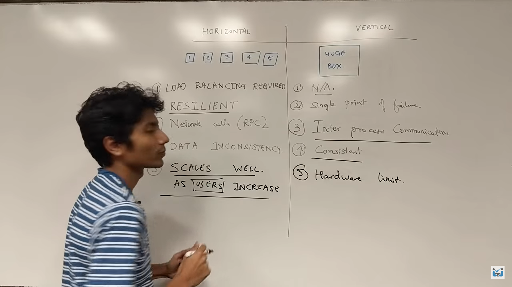

# System Design Safari

S**ystem Design** is the process of designing the architecture, components, and interfaces for a system so that it meets the end-user requirements.

***Scalability** is the capacity of a system to adapt its performance and cost to the new changes in application demands.*

## What is Vertical Scaling? → Increase Power

By adding more configuration or hardware for better computing or storage, vertical scaling expands the scale of a system.

## What is Horizontal Scaling? → Increase Units

Through the act of adding new machines, a system can be scaled horizontally. Several devices must be gathered and connected in order to handle more system requests.

- **Data Redundancy:** Data redundancy refers to the storage of the same data in multiple places within a system or across systems. The primary purpose of data redundancy is to enhance data availability and fault tolerance. It ensures that data remains accessible even if one copy of the data becomes unavailable due to hardware failures or other issues.
- **Data Replication:** Data replication, on the other hand, is the process of copying data from one location to another, typically across multiple servers or data centers. The primary purpose of data replication is to improve data access speed, distribution, and load balancing. It is often used to provide low-latency access to data for users in different geographical locations.

## **Microservices**

Microservices, in simple terms, is an approach to building and organizing software applications as a **collection of small, independent, and specialized services** that work together to provide a complete application. It's like breaking down a large application into tiny, self-contained pieces, each responsible for a specific function or feature.

Here's a more detailed explanation:

**Small Services**: Instead of building one big, monolithic application, you create many small services. Each service is like a mini-application that performs a single task or function. For example, one service might handle user registration, another might handle product catalog, and yet another might handle payment processing.

Think of microservices as a way to build software like assembling Lego blocks. Each block (service) has a specific function, and you can combine them in various ways to create complex structures (your application) that are easier to build, modify, and maintain compared to a single giant block (monolithic application).

For example

**Uber**:

- **Ride Booking Service**: Allows users to request rides.
- **Driver Matching Service**: Matches drivers with nearby ride requests.
- **Payment Processing Service**: Handles payment transactions for rides.
- **Geolocation Service**: Provides real-time location data for drivers and riders.

## Distributed system

A distributed system is a network of interconnected computers (or nodes) that work together to achieve a common goal, even though they may be physically separate and located in different geographical locations.

Types

1. **Client-Server Architecture**:
    - **Example**: Web servers and web browsers. When you access a website using your browser (the client), it communicates with a web server to request and retrieve web pages.
2. **Peer-to-Peer (P2P) Systems**:
    - **Example**: BitTorrent is a P2P file-sharing system where users share files directly with one another without relying on a central server. Each user acts as both a client and a server.
    

## Decoupling

Seperation of tasks

Decoupling is a design principle in computer science and system architecture that involves reducing the interdependencies between different components or modules of a system. The goal of decoupling is to make components or modules more independent and less reliant on each other

Examples of decoupling in software design and system architecture include:

- **Service-Oriented Architecture (SOA)**: SOA decouples software services by defining clear interfaces and communication protocols. Services can be developed, deployed, and maintained independently, promoting flexibility and scalability.
- **Message Queues**: Systems that use message queues, such as RabbitMQ or Apache Kafka, decouple producers and consumers of messages. Components can produce messages without worrying about who consumes them and vice versa.
- **Model-View-Controller (MVC) Pattern**: In MVC, the model, view, and controller are decoupled. The model represents the data and logic, the view handles the presentation, and the controller manages user input. This separation makes it easier to change the user interface or underlying data without affecting the others.
- **Microservices Architecture**: Microservices decouple different parts of a software application into independently deployable services, each with its own functionality and data storage. This architecture enhances scalability and agility.

## What happens when you enter “[google.com](http://google.com/)”?

1. DNS resolution → Converts [googl.com](http://googl.com) to It’s IP
2. Establishing a TCP Connection
3. Browser sends an HTTP (Hypertext Transfer Protocol) request to the Google web server, asking for the content of the main page or the page specified in the URL.
4. Google's web server receives the request, processes it, and generates an appropriate response.
5. The browser receives the HTML response from the web server and renders it into a visual web page, which may include text, images, links, and other elements.

## Load Balancing

[https://aws.amazon.com/what-is/load-balancing/](https://aws.amazon.com/what-is/load-balancing/)

technique used in computer networks and server systems to distribute incoming work (such as network traffic or requests for a website) across multiple servers.

Imagine a popular website that receives many visitors. Instead of one server trying to handle all the incoming requests, load balancing spreads the incoming traffic across several servers.

load balancing algorithms

1. Round Robin  → evenly distributes. cons : overload
    
     Ex 10 req and 5 server then each contains 2 req first server have re no. [1,6]
    
2. Weighted RR  → Each server has weighted based on power/capacity
3. Weighted Least Connections →
    
     Similar to the weighted round robin, but it takes into account the number of active connections. Servers with higher weights and fewer active connections receive more traffic.
    
4. IP Hash → use hashfunction
    
    algorithm uses the source IP address of the client to determine which server to send the request to. This ensures that requests from the same client always go to the same server, which can be important for maintaining session consistency.
    
5. Least Connections
    
    Servers with the fewest active connections receive new requests. This algorithm is more efficient in terms of server utilization as it directs traffic to less busy servers.
    
6. Least Response Time
    
    Requests are directed to the server with the fastest response time. This algorithm measures server performance and dynamically adjusts traffic distribution to optimize response times.
    
    When to use when?
    
    | Load Balancing Algorithm | Scenario | Example |
    | --- | --- | --- |
    | Round Robin | Even distribution of traffic to similar servers | Small web application with identical servers |
    | Least Connections | Efficiently distribute traffic based on load | E-commerce site with resource-intensive queries |
    | Weighted Round Robin | Proportional allocation of resources | Video streaming service with varying server capabilities |
    | Weighted Least Connections | Efficiently distribute traffic based on load and capacity | Online gaming platform with servers of varying capacity |
    | IP Hash | Session persistence for users | Applications with user login sessions |
    | Least Response Time | Optimize for fastest response times | Content delivery network (CDN) for media files |

## Consistent Hashing

Problem occurs when we have to add/remove servers

technique used to distribute data across multiple servers or nodes in a way that minimizes the amount of data movement when nodes are added or removed from the system.

use a hashing function to map each piece of data to a point on a circular "hash ring." Each server is also represented on this ring. The data is then stored on the server whose position on the ring is closest in a clockwise direction to the data's position.

**Node Additions or Removals:** When you add a new server or remove one, only a portion of the data needs to be moved to rebalance the system, reducing the impact of changes.

**Fault Tolerance:** If a server fails, its data can be easily redistributed to other servers, ensuring continued availability.

Consistent Hashing on an average requires only **k/n units of data** to be migrated during scale up and down.

k is the total number of keys and n is the number of nodes in the system.

2 Problem 

1. Need to re-map when we add/remove servers 
    
     Solution : Have a replica of servers like S1-A, S1-B across ring
    
2. reqs. are not evenly distributed
    
    Solution : Use multiple hash functions
    

## Database Sharding

splitting a large database into smaller, more manageable pieces called "shards.”

Sharding breaks this database into smaller, independent pieces, each with its own part of the data. Each shard can be hosted on a separate server or node. This way, when you query the database, the workload is distributed across multiple shards, which can be processed in parallel. It helps improve both read and write performance.

## Bloom Filters

efficiently test that the element is present or not in a set. It's particularly useful when you need to quickly check whether an element is in a large dataset, without having to store the entire dataset in memory. Bloom filters are space-efficient and offer constant-time lookups, making them suitable for various applications such as cache systems, network routers, and databases.

1. Create a bit array of a fixed size and initialize all bits to 0
2. To add an element to the Bloom filter, you hash the element with multiple independent hash functions, which generate a set of indexes in the bit array. You then set the corresponding bits at those indexes to 1.
3. To check if an element is in the Bloom filter, you hash the element with the same hash functions and check the bits at the generated indexes. If all bits are 1, the element is "possibly" in the set. If any of the bits are 0, the element is definitely not in the set.

there can be false positives, meaning the filter may indicate an element is in the set when it is not, but there are no false negatives.

take more hash functions for accurate probabilistic answer

k= hash functions

The time complexity for adding an element and querying an element is O(k).

## Data Replication

Involves creating and maintaining multiple copies of data across distributed systems or storage devices. The primary purpose of data replication is to enhance data availability, fault tolerance, and performance in a distributed computing environment.

1. **Master-Slave Replication** 
2. **Multi-Master Replication**

All works by sync with each other so high avaiibilty 

Problem: What if the connection between 2 Master is Break.

In that case both master will perform same operation so it’s going to be twise

which is called split brain problem

Solution : Add another Master between 2 master

1. **Peer-to-peer**

all nodes are equal peers and can both read and write data. Changes are propagated among peers, This approach is often used in distributed file systems and peer-to-peer networks.

When to use which?

- **Master-Slave Replication** when high read scalability  and strong data consistency, or require a single source of truth.
    
    *Example: E-commerce Website*
    
- **Multi-Master Replication** when high write scalability and high availability are essential, and you have mechanisms in place to handle conflicts.
    
    *Example: Collaborative Document Editing Platform*
    
- **Peer-to-Peer Replication** when you want a decentralized, fault-tolerant setup with no single point of failure, and data distribution and load balancing are important.
    
    *Example: File Sharing in a Peer-to-Peer Network*
    
    ## Decide DB
    
    
    
    1. **Relational Databases (SQL)**: Use for structured data with strong consistency, e.g., e-commerce transactions.
    2. **NoSQL Databases**: Ideal for unstructured or semi-structured data, such as social media posts or IoT sensor readings.
    3. **Graph Databases**: When relationships are crucial, like in recommendation systems.
    4. **Time-Series Databases**: For time-stamped data, like IoT sensor readings.
    5. **Columnar Databases**: Best for analytical workloads and data warehousing.
    6. **In-Memory Databases**: For low-latency, high-throughput applications, such as gaming.
    7. **NewSQL Databases**: When you need SQL consistency and scalability, e.g., online banking platforms.
    
    ## Database Migration
    
    1. **Assessment and Planning**:
        - **Data Analysis**: Begin by analyzing the source database to understand its schema, data structure, and relationships.
        - **Destination Database**: Select and set up the target database system, ensuring it's compatible with the data format and requirements.
        - **Mapping**: Create a mapping or transformation plan that defines how data from the source database will be mapped to the target database, including any schema changes or data conversions.
    2. **Backup and Data Integrity**:
        - **Backup**: Before any data migration, make a backup of the source database to ensure you can recover in case of unexpected issues during the migration process.
        - **Data Consistency**: Implement mechanisms to maintain data consistency during the migration. This may involve locking records, tracking changes, or using timestamps to avoid data conflicts.
    3. **ETL (Extract, Transform, Load)**:
        - **Extract**: Extract data from the source database using ETL tools or custom scripts. Ensure that you extract all the required data without loss or corruption.
        - **Transform**: Apply any necessary data transformations, such as data format conversions, data cleansing, and schema mapping.
        - **Load**: Load the transformed data into the destination database. Be mindful of data validation and ensure data integrity during this phase.
    4. **Testing and Verification**:
        - **Data Validation**: Run tests to verify the correctness and completeness of the migrated data. This may involve comparing data in the source and destination databases to ensure consistency.
        - **Performance Testing**: Assess the performance of the new database system with the migrated data to ensure it meets performance expectations.
        
        ## Consistency
        
        If u have multiple copy of data then it should match each other and content should be same
        
        How to achieve?
        
        Use TCP Handshake protocol
        
        2 Database send check msg and Receive Ack that data is same
        
        **Strong Consistency**:
        
        Strong consistency ensures that every read operation on the data returns the most recent write, and all replicas of the data are in agreement at all times. In other words, strong consistency guarantees that a read operation will return the latest committed version of the data. Achieving strong consistency often involves coordination mechanisms, like locking or two-phase commits, which can lead to increased latency and reduced system availability.
        
        *Example*: A banking application, Stock Exchange platform
        
        **Eventual Consistency**:
        
        Eventual consistency, on the other hand, allows for a temporary lack of agreement between replicas but guarantees that, given enough time and no further updates, all replicas will converge to the same value. It is often used in distributed systems to improve availability and performance, especially when strong consistency would be too expensive. 
        
        *Example*: Consider a social media platform where users' posts and comments, Youtube Video views
        
        ## CAP Theorem
        
        
        
        Message Broker
        
        1. Queue based 
        
        2. Topic based
        
        ## Message Queue
        
        A message queue is a communication mechanism used in system design to enable asynchronous and decoupled communication between different parts of a system or between distributed components. It allows one component (the sender) to send a message to a queue, and another component (the receiver) to retrieve and process messages from the queue.
        
        • Examples of queues: Kafka, Heron, real-time streaming, Amazon SQS, and RabbitMQ.
        
        
        
        Example : E-commerce Order Processing, Email, generating reports, sending notifications, or processing user requests asynchronously 
        
        ## Publisher Subscriber Model
        
        It is a form of asynchronous communication that facilitates the decoupling of components within a system
        
        1. Publisher: The publisher is responsible for sending messages (events or data) to a central communication channel or topic. The publisher does not need to know who will receive the messages; it simply publishes them to a specific topic.
        2. Subscriber: Subscribers express their interest in receiving messages from specific topics or channels. When a subscriber subscribes to a topic, it indicates that it wants to receive messages related to that topic.
        3. Message Routing: A message broker or message queue is typically used to route messages from publishers to subscribers. This central component manages the distribution of messages to the appropriate subscribers based on their expressed interests.  
        
        Publisher → Topic Based Message Broker  ← → Subsriber
        
        Decoupling: Publishers and subscribers are loosely coupled, meaning they don't need to be aware of each other's existence.
        
        Scalability: This model allows for the easy addition of new subscribers without affecting the publishers or other subscribers.
        
        
        
        
        
        simple example of a weather notification system using the Publisher-Subscriber model:
        
        1. Publishers:
            - Publisher 1: A temperature sensor that publishes temperature updates.
            - Publisher 2: A humidity sensor that publishes humidity updates.
        2. Message Broker: A central component responsible for routing messages to subscribers based on topics.
        3. Subscribers:
            - Subscriber A: A mobile app that wants to receive temperature updates.
            - Subscriber B: An IoT device that wants to receive humidity updates.
            - Subscriber C: A weather dashboard application that wants both temperature and humidity updates.
        
        Here's how the system works:
        
        1. Publisher 1 sends temperature updates to the message broker with the topic "Temperature."
        2. Publisher 2 sends humidity updates to the message broker with the topic "Humidity."
        
        Subscribers express their interest in specific topics:
        
        - Subscriber A subscribes to the "Temperature" topic.
        - Subscriber B subscribes to the "Humidity" topic.
        - Subscriber C subscribes to both "Temperature" and "Humidity" topics.
        
        When new updates are published:
        
        - Subscriber A receives temperature updates.
        - Subscriber B receives humidity updates.
        - Subscriber C receives both temperature and humidity updates.
        
        
        
        ## Event-Driven Model
        
        Similar to req. response model but here it is based on events. t is used to handle asynchronous communication and respond to events or triggers as they occur. In this model, the system components are designed to respond to events without waiting for them.
        
        
        
        Features
        
        Easy Rollbased as we just need to to restore events
        
        Components don't need to know the specifics of the other components they interact with; they only need to understand the events they generate and consume.
        
        Example : Git, React,Node etc
        
        ## Container
        
        a container is a lightweight, stand-alone and executable software package that includes everything needed to run a piece of software, including the code, runtime, system tools, libraries, and settings.
        
        Containers provide isolation, portability, and scalability, making them popular for deploying and managing software. Docker is a well-known containerization technology, and Kubernetes is used for container orchestration and mangement.
        
        ## Service Discovery & heartbeats
        
        monitoring the status and health of a component or service within a distributed system or network. provides information about the current state or health of that service. It is used to determine whether the service is functioning correctly and can respond to requests.
        
        
        
        Heartbeats are a mechanism for regularly sending signals or messages from one component or node to another in a distributed system to indicate that they are alive and operational. These signals serve as a way to monitor the availability and health of the remote component.
        
            Load Balancer ↔Health Service  ↔ Service  
        
        ## Avoid Cascading Failures
        
        situation where a failure or disruption in one part of a system triggers a chain reaction of failures in other interconnected components or services, potentially leading to a widespread and catastrophic system outage.
        
        Strategies to mitigate cascading failures include implementing redundancy and failover mechanisms, monitoring system health, load balancing, and resource isolation.
        
        ## Anomaly Detection
        
        Anomalies can be indicative of issues, errors, or malicious activities.
        
        1. Use statistical thresholds or time-series analysis.
        2. Employ machine learning algorithms.
        3. Analyze user behavior and application logs.
        4. Monitor network and log data.
        
        ## Rate Limiting
        
        It is a technique used to control and limit the rate or frequency at which a client, user, or application can make requests or perform certain actions on a system, service, or API.
        
        
        
        **3 Approaches**
        
        User, Geographic and server rate limits. 
        
        **Algorithms to Implement rate limiter.**
        
        1. Token Bucket
        - uses a token bucket that refills at a constant rate (tokens per second).
        - Each incoming request consumes one token from the bucket.
        - Requests are only allowed if there are sufficient tokens in the bucket.
        1. Leaky Bucket
        - processes requests at a fixed rate and discards excess requests.
        - Requests are added to the "bucket" at the arrival rate, and if the bucket overflows, excess requests are discarded.
        
        
        
        
        
        1. Fixed Bucket
        - a fixed time window is defined, and requests are counted within that window.
        - If the count exceeds a predefined limit, further requests are rejected.
        - It's straightforward but can lead to uneven distribution of requests at the end of each window.
        
        
        
        Problem : Clustering around boundary of 2 bucket
        
        1. Sliding Window
        - Requests within the sliding window are counted, and if they exceed the limit, additional requests are rejected.
        
        
        
        **When to use which?**
        
        | Consideration | Factors to Consider | Algorithm Choices | Reasons | Examples |
        | --- | --- | --- | --- | --- |
        | Traffic Patterns | - Bursty or steady traffic patterns | - Token Bucket | - Token Bucket can smooth out bursty traffic by allowing requests when tokens are available and holding them back when the bucket is empty. | - API endpoint with intermittent high bursts of requests. |
        |  |  | - Leaky Bucket | - Leaky Bucket can control the rate of requests, ensuring a consistent flow by discarding excess traffic. | - Network bandwidth management for a constant data stream. |
        |  |  | - Fixed Window | - Fixed Window can be suitable for consistent traffic patterns, but it may lead to uneven request distribution at the window boundary. | - An email server handling messages arriving at a regular interval. |
        |  |  | - Sliding Window | - Sliding Window can provide a balance between controlling bursts and maintaining a more continuous rate. | - A video streaming service with varying viewer traffic. |
        | Fairness | - Equal treatment of all users or clients | - Token Bucket | - Token Bucket and Leaky Bucket are known for their fairness in distributing requests evenly across clients. | - Rate limiting API calls from multiple clients with equal shares. |
        | Scalability | - Distributed systems | - Token Bucket | - Token Bucket is relatively easy to implement in distributed systems and maintains fairness. | - A global content delivery network with distributed edge nodes. |
        |  |  | - Leaky Bucket | - Leaky Bucket can also work in distributed systems, providing fairness in rate limiting. | - A microservices architecture with distributed request handling. |
        |  |  | - Fixed Window | - Fixed Window can be adapted to distributed systems but may require more effort to maintain fairness. | - A cloud-based application across multiple regions. |
        |  |  | - Sliding Window | - Sliding Window can be adapted to distributed systems and provides control over rate limiting. | - A distributed API gateway handling diverse workloads. |
        
        ## Cache
        
        
        
        
        
        **Cache Invalidation**:
        
        process of marking data as no longer valid or stale.
        
        It typically occurs when the data in the cache becomes outdated, no longer accurate, or irrelevant due to changes in the underlying data source or system.
        
        Cache invalidation can be achieved using various methods, such as time-based expiration (e.g., setting a cache entry to expire after a certain time), event-based invalidation (listening for change events in the data source), and manual invalidation (explicitly marking cached data as invalid).
        
        deals with maintaining data accuracy in the cache by removing or marking items as invalid when changes occur in the original data source.
        
        **Cache Eviction**:
        
        Cache Eviction is the process of removing items from the cache to free up space for new or more relevant data.
        
        focused on managing the cache's size and removing less relevant or outdated data to make room for new entries, without necessarily considering the data's validity.
        
        ## CDN - Content Delivery Network
        
        CDN is a network of geographically distributed servers that work together to deliver web content and other digital assets to users based on their location.
        
        
        
        Ex. Cloudflare CDN, AWS Cloudfront etc
        
        A distributed database is primarily used for storing and processing data, while a CDN is primarily used for delivering web content.
        
        Globally Distributed group of servers that cache static assets for origin server.
        
        1. directs the request to the nearest edge server based on the user's location.
        2. cache static content on their edge servers. Frequently requested content is stored locally on these servers, reducing the need to fetch it from the origin server each time.
        3. balance traffic by directing user requests to the least congested and nearest edge server
        
        **Push CDN**
        
        content is uploaded directly to the CDN servers by the content provider
        
        Offer more control and consistency
        
        suitable for static or infrequently changing content.
        
        
        
        **Pull CDN**
        
        CDN servers fetch content from the origin server (content provider) when a user requests it. The CDN server pulls the content on-demand as needed.
        
        Content is automatically fetched and cached when a user requests it.
        
        more efficient and automatic, making them a good choice for dynamic content or scenarios where content changes frequently.
        
        
        
        ## **Write and Write Back Policy**
        
        Write Policies:
        
        - Write-Through: Writes data to cache and main memory simultaneously, ensuring strong data consistency.
        - Write-Behind: Delays writing to main memory until cache eviction, prioritizing write performance over immediate consistency.
        
        Write Back Policies:
        
        - Write-Back: Writes data to cache first, delaying main memory writes until cache eviction to improve write performance.
        - Write-Once: Data is written to the cache but never updated or replaced, suitable for read-only or immutable data.
        
        ## Cache Replacement Policies
        
        Process of selecting which data block or cache line to evict when new data needs to be loaded into the cache and there is no available space.
        
        - **Cache Hit**: Data is found in the cache, resulting in fast access.
        - **Cache Miss**: Data is not in the cache, requiring slower access from a higher-level memory source.
        
        
        
        
        
        
        
        
        
        In Tie → Follow FIFO
        
        ## Micro Services
        
        **Monolithic Architecture:**
        
        Single Codebase: In a monolithic architecture, the entire application is built as a single, self-contained unit. All components and functionality are tightly integrated into a single codebase.
        
        good choice for small to medium-sized projects with a limited development team and straightforward requirements.
        
        Examples:
        
        1. Blogging Platform: 
        2. E-commerce Site (Small Scale): 
        3. Internal Tools:
        
        **Microservices Architecture:**
        
        Distributed Components: Microservices break down the application into small, independently deployable services. Each service focuses on a specific functionality or feature.
        
        suitable for large, complex applications that require scalability, technology diversity, and the ability to evolve and change individual parts of the system independently.
        
        Examples:
        
        1. Large E-commerce Platform: 
        2. Social Media Platform: 
        3. Financial Services: 
        4. Streaming Services: 
        5. Online Gaming: 
        
        
        
        ## Move from a monolithic to a microservices architecture:
        
        1. **Assessment and Planning:**
            - Understand your current monolithic application.
            - Identify the reasons for moving to microservices.
            - Create an architectural plan.
        2. **Decomposition:**
            - Break down the monolith into smaller components.
            - Decide which components become microservices.
        3. **Database Decoupling:**
            - Move from a shared database to separate data stores.
        4. **API Design:**
            - Define clear APIs for each microservice.
            - Choose a communication protocol.
        5. **Containerization and Orchestration:**
            - Containerize with Docker.
            - Use Kubernetes for orchestration.
        
        ## APIs
        
        
        
        "Application Programming Interface," is a set of rules and protocols that allows different software applications or components to communicate with each other.
        
        A RESTful API, or Representational State Transfer API, is a specific style of API design that adheres to a set of architectural principles and constraints.
        
        
        
        1. **Stateless:** Each request from a client to the server must contain all the information needed to understand and process the request. The server does not store any information about the client's state between requests. This statelessness simplifies the scalability of the system.
        2. **Client-Server Architecture:** A clear separation between the client (the user interface) and the server (the data storage and processing) allows for more flexibility and scalability. The client and server can evolve independently.
        3. **Uniform Interface:** A consistent and standardized way of interacting with resources is provided. This includes using HTTP methods like GET (for retrieval), POST (for creation), PUT (for updates), and DELETE (for removal) to perform operations on resources.
        4. **Resource-Based:** RESTful APIs are built around resources, which are typically represented by URLs. Resources can be anything that can be uniquely identified, such as objects, documents, or data entities.
        5. **Representation:** Resources are represented in various formats, typically using JSON or XML, allowing clients to understand and manipulate the data. The format is specified using the "Content-Type" header in HTTP.
        
        ## Remote Procedure Call (RPC)
        
        RPC APIs allow developers to call remote functions in external servers as if they were local to their software. For example, you can add chat functionality to your application by remotely calling messaging functions on another chat application.
        
        RPC focuses on functions or actions, while REST focuses on resources or objects.
        
        **RPC Principles:**
        
        1. **Remote Invocation:**
            - Client calls a function on a remote server as if it were local.
        2. **Passing Parameters:**
            - Client sends parameters to the server function, similar to a local function.
        3. **Stubs:**
            - Function stubs exist on both client and server, facilitating the function call.
        
        **REST Principles:**
        
        1. **Client-Server:**
            - Decouples clients and servers as independent systems.
        2. **Stateless:**
            - Server keeps no client state between requests.
        3. **Cacheable:**
            - Responses may be cached by client or intermediaries.
        4. **Layered System:**
            - Intermediaries can exist between client and server transparently.
        5. **Uniform Interface:**
            - Standardized instructions and messaging formats for communication via REST API. Resources identified by URLs (endpoints).
        
        | **Action** | **RPC** | **REST** | **Comment** |
        | --- | --- | --- | --- |
        | Adding a new product to a product list | POST /addProduct HTTP/1.1
        HOST: api.example.com
        Content-Type: application/json
        {"name": "T-Shirt", "price": "22.00", "category": "Clothes"} | POST /products HTTP/1.1
        HOST: api.example.com
        Content-Type: application/json
        {"name": "T-Shirt", "price": "22.00", "category": "Clothes"} | RPC uses *POST* on function, and REST uses *POST* on URL. |
        | Retrieving a product’s details | POST /getProduct HTTP/1.1
        HOST: api.example.com
        Content-Type: application/json
        {"productID": "123”} | GET /products/123 HTTP/1.1
        HOST: api.example.com | RPC uses *POST* on function and passes parameter as JSON object. REST uses *GET* on URL and passes parameter in URL. |
        | Updating a product’s price | POST /updateProductPrice HTTP/1.1
        HOST: api.example.com
        Content-Type: application/json
        {"productId": "123", "newPrice": "20.00"} | PUT /products/123 HTTP/1.1
        HOST: api.example.com
        Content-Type: application/json
        {"price": "20.00"} | RPC uses *POST* on function and passes parameter as JSON object. REST uses *PUT* on URL and passes parameter in URL and as JSON object. |
        | Deleting a product | POST /deleteProduct HTTP/1.1
        HOST: api.example.com
        Content-Type: application/json
        {"productId": "123""} | DELETE /products/123 HTTP/1.1
        HOST: api.example.com | RPC uses *POST* on function and passes parameter as JSON object. REST uses *DELETE* on URL and passes parameter in URL. |
        
        **Use RPC When:**
        
        - **Complex Operations:** Need to perform complex operations with remote functions.
        - **Tight Integration:** Require a more direct and tightly integrated communication model.
        - **Efficiency:** Need efficient communication for specific use cases.
        
        **Use REST When:**
        
        - **Stateless Operations:** Stateless interactions suffice; no need to maintain client state on the server.
        - **Scalability:** Aim for scalability and separation between client and server.
        - **Resource-Based Operations:** Fit well with resource-oriented architectures, CRUD operations on resources.
        - **Standardization:** Require adherence to standardized principles for web APIs.
        
        ## OAuth
        
        Open **Authorization**
        
        It allows users to grant third-party applications **limited access** to their resources, such as their social media profiles or online accounts, without sharing their credentials (e.g., username and password).
        
        Here is the flow(Also called implicit flow)
         1. Application ask access token(limited access) to Resource Application.
        
        1. Resource Application talk to client and ask do we allow or not?
        2. If client says yes! Resource Application gives token 
        3. so every time application wants resource it first sends with token for authorization
        
        
        
        
        
        
        
        ## Authorization
        
        
        
        **Session Token**
        
        associated with stateful server-side sessions.
        
        The server stores session data on the server and associates a unique session token with each user's session.
        
        lead to additional server load and scalability challenges.
        
        
        
        **JWT - JSON Web Token**
        
        JWTs are stateless, meaning they contain all the information needed for authentication and authorization within the token itself.
        
        typically stored on the client side, often in browser storage or cookies. This reduces the server's responsibility for managing user sessions.
        
        JWTs can be long-lived and persistent, potentially lasting for an extended period or even indefinitely.
        
        
        
        ## Notification Architecture
        
        1. **Push Notification Architecture:**
            - **Definition:**
            In a push notification architecture, the server initiates the notification to the client without the client specifically requesting the information. The server "pushes" the notification to the client devices.
            - **Workflow:**
                1. **Event Occurs:** Something happens on the server that triggers a notification (e.g., new message, update, or alert).
                2. **Server Sends Notification:** The server sends the notification to all registered clients or specific clients based on the event.
                3. **Client Receives Notification:** The client device receives and displays the notification to the user.
            - **Advantages:**
                - Real-time updates: Notifications are delivered instantly.
                - Efficient for time-sensitive information.
            - **Challenges:**
                - Increased server load: Constantly pushing notifications may increase server load.
                - Potential battery drain on client devices.
            
            E**xample:**
            
            1. **Scenario:**
                - User A receives a new message from User B.
            2. **Push Notification Workflow:**
                - **Event Occurs:** User B sends a message to User A.
                - **Server Sends Notification:** The messaging server detects the new message and sends a push notification to User A's device.
                - **Client Receives Notification:** User A's device receives the push notification, and a notification is displayed on the screen, alerting the user about the new message.
        2. **Pull Notification Architecture:**
            - **Definition:**
            In a pull notification architecture, the client periodically queries or "pulls" the server for updates. The client is responsible for checking whether there are new notifications or changes.
            - **Workflow:**
                1. **Client Requests Update:** The client sends requests to the server at predefined intervals.
                2. **Server Responds with Updates:** If there are new notifications or changes, the server responds with the relevant information.
                3. **Client Processes Updates:** The client receives and processes the updates, notifying the user if necessary.
            - **Advantages:**
                - Reduced server load: The server only responds when the client requests updates.
                - Potentially lower impact on battery life.
            - **Challenges:**
                - Delayed updates: Notifications may not be instant, depending on the client's polling frequency.
                - Increased network traffic: Clients periodically polling the server can lead to increased network usage.
            
            **Example:**
            
            1. **Scenario:**
                - User A wants to check for new messages in the messaging application.
            2. **Pull Notification Workflow:**
                - **Client Requests Update:** User A's device periodically sends requests to the messaging server, asking if there are any new messages.
                - **Server Responds with Updates:** The server checks for new messages and responds to User A's device with the relevant information.
                - **Client Processes Updates:** If there are new messages, the client processes the updates and displays the new messages to User A.
        3. **Hybrid Architecture**
        
        For example, a messaging application might use push notifications to alert users about new messages when the app is not actively running. Simultaneously, when the user opens the app, the client may pull additional updates to ensure the most recent information is displayed.
        
        ## Idempotent
        
        Idempotent operations produce the same result even when the operation is repeated many times. The result of the 2nd, 3rd, and 1,000th repeat of the operation will return exactly the same result as the 1st time.
        
        **HTTP methods like GET, HEAD, PUT, DELETE, OPTIONS, and TRACE are idempotent, while POST and PATCH are generally non-idempotent.**
        
        Imagine a scenario where an API facilitates monetary transactions between accounts. A user sends a request to transfer $100 from Account A to Account B. Due to network latency or other factors, the request is unintentionally duplicated. Without idempotency, the API would process both requests, resulting in an unintended transfer of $200. However, if the operation is idempotent, only one transfer of $100 will occur, regardless of the number of duplicate requests.
        
        x + 0;
        
        x = 5;
        
        The first of these, adding zero, will return the same value every time (it is idempotent), and adding zero will have no effect on that value (it is also safe). The second example will return the same value every time (it is idempotent) but is not safe (if x is anything other than 5 before the operation runs, it changes x).
        
        Therefore, all safe methods are idempotent, but not all idempotent methods are safe.
        
        ## Bandwidth
        
        It represents the maximum amount of data that can be transmitted over the channel in a given amount of time.
        
        ## Latency & Throughput
        
        - **Latency:** Focuses on the time it takes for a single piece of data to travel from one point to another. Calculate latency by using ping times.(in ms)
            
            factors ; *Location, Network congestion, Network congestion(Extra protocol)*
            
        - **Throughput:** Focuses on the amount of data that can be processed or transferred per unit of time.
            
            factors : *Bandwidth, Processing power, packet loss*
            
        
        **Effect on Performance:**
        
        - **Latency:** Affects the responsiveness of a system. Lower latency is generally desirable, especially in real-time applications.
        - **Throughput:** Reflects the system's capacity to handle a certain amount of data. Higher throughput indicates better performance in terms of data transfer rates.
        - 
    
    Bandwidth is how much data you can transfer theoretical, while throughput is the actual amount of data you transmit in any given moment based on real-world network limitations. A high bandwidth does not guarantee speed or a good network performance, but a higher bandwidth leads to higher throughput.
    
    ## **How do acid transactions work?**
    
    1. **Begin Transaction**: A **BEGIN TRANSACTION** statement declaration initiates a transaction and establishes a savepoint from which the transaction can be rolled back if necessary.
    2. **Execute operations**: All operations within the transaction are executed one at a time. The database validates each operation to ensure it complies with the constraints and schema.
    3. **Commit or Rollback**: Following the successful completion of all operations, the transaction is committed using the **COMMIT** statement. The transaction is rolled back to the savepoint established at the beginning of the transaction if any operation fails.
    
    ## SQL vs NoSQL  (Not Only SQL)
    
    **SQL (Relational Databases):**
    
    - Structured data, fixed schema.
    - ACID compliance.
    - Suitable for complex queries and JOIN operations.
    - Vertical scaling.
    
    **NoSQL (Non-relational Databases):**
    
    - Unstructured or semi-structured data.
    - Dynamic schema, adaptable to changes.
    - Horizontal scaling.
    - High-volume, low-latency reads/writes.
    - Prioritizes availability and partition tolerance.
    - Agile development, quick iterations.
    
    **Considerations:**
    
    - Specific project needs.
    - Nature of data.
    - Scalability requirements.
    - Team expertise.
    - Consider hybrid approaches for varied use cases.
    
    ## **Circuit Breaker**
    
    
    
    A circuit breaker is an electrical switch that operates automatically to protect an electrical circuit from damage done by an overload (ex: lightning strike) or short circuit. Its main purpose is to stop current flow when a defect is identified and protect the electrical appliances at your home.
    
    ## **Circuit Breaker Pattern**
    
    The Circuit Breaker design pattern is a software design pattern used in distributed systems to improve the resiliency and fault tolerance of applications **by detecting and handling faults in a timely manner.** The pattern is named after electrical circuit breakers, which automatically interrupt electrical flow when a fault is detected to prevent further damage.
    
    Here's a brief overview of the Circuit Breaker design pattern:
    
    1. **Purpose:**
        - The primary goal is to prevent a system from repeatedly trying to execute an operation that is likely to fail, allowing it to recover and handle the failure gracefully.
    2. **Key Components:**
        - **Closed State:** Initially, the circuit breaker is in a closed state, allowing the system to attempt the operation. If the operation fails within a specified threshold, the circuit breaker moves to the open state.
        - **Open State:** In the open state, the circuit breaker prevents further execution of the operation, returning a predefined fallback or error response without attempting the actual operation. This state helps in preventing the system from continuous failure.
        - **Half-Open State:** After a certain period in the open state, the circuit breaker transitions to a half-open state, allowing a limited number of trial executions. If these trials succeed, the circuit breaker moves back to the closed state; otherwise, it remains open.
    
    ## Proxy Server
    
    Intermediate server that acts as a gateway between a user's device and the internet.
    
    
    
    1. **Anonymity and Privacy:** Proxy servers can mask the user's IP address, providing a level of anonymity. This is often used to protect privacy or bypass regional restrictions.
    2. **Content Filtering:** Organizations often use proxy servers to control and monitor the content accessed by their users. This can help enforce company policies and filter out potentially harmful or inappropriate content.
    3. **Caching:** Proxy servers can cache frequently accessed web content, reducing the load on the internet and improving response times for users. This is especially beneficial in networks with high traffic.
    
    Types
    
    sits in front of a group of client machines. When those computers make requests to sites and services on the internet, the proxy server intercepts those requests and then communicates with web servers on behalf of those clients, like a middleman.
    
    
    
    A reverse proxy is a server that sits in front of one or more web servers, intercepting requests from clients. When clients send requests to the origin server of a website, those requests are intercepted by the reverse proxy server.
    
    
    
    Other Types
    
    1. **Data Center Proxy:**
        - Not affiliated with an ISP.
        - Quick response times and cost-effective.
        - Lower anonymity level; potential security risks.
    2. **Residential Proxy:**
        - Uses IP addresses from physical devices.
        - Trustworthy for ad verification.
    3. **Public Proxy:**
        - Free and accessible to anyone.
    4. **Shared Proxy:**
        - Used by multiple users simultaneously.
        - Economical but may result in shared consequences.
    5. **SSL Proxy:**
        - Provides decryption between client and server.
    6. **HTTP Proxy:** Handles web traffic and is commonly used for web content filtering and caching. It is suitable for tasks like controlling access to websites.
    7. **Transparent Proxy:** Operates without modifying requests and responses, making it invisible to the end user. Often used for content filtering and monitoring.
    8. **Anonymous Proxy:** Focuses on providing anonymity to users by hiding their IP addresses. It helps protect privacy by not disclosing the user's identity to the destination server.
    
    ## DNS
    
    **authoritative DNS** servers store and provide DNS records for specific domains, while **recursive DNS resolvers** help users or local networks by finding and retrieving the necessary DNS information from authoritative servers.
    
    The DNS resolver is the first stop in the DNS lookup, and it is responsible for dealing with the client that made the initial request. The resolver starts the sequence of queries that ultimately leads to a URL being translated into the necessary IP address.
    
    
    
    
    
    The three types of DNS queries are:
    
    1. **Recursive Query:**
        - **Description:** Resolves the entire query for the client.
        - **Use Case:** Common in user requests for domain resolution.
    2. **Iterative Query:**
        - **Description:** Provides the best information available, possibly with referrals.
        - **Use Case:** Used between DNS servers during the resolution process.
    3. **Non-Recursive Query (Simple Query):**
        - **Description:** Offers information it has or refers to another server without further resolution.
        - **Use Case:** Less common, often used in specific DNS server-to-server communications.
    
    ## **API Gateway**
    
    An [**API gateway**](https://www.nginx.com/resources/glossary/api-gateway/) accepts API requests from a client, processes them based on defined policies, directs them to the appropriate services, and combines the responses for a simplified user experience. Typically, it handles a request by invoking multiple microservices and aggregating the results. It can also translate between protocols in legacy deployments.
    
    
    
    ## D**istributed locking**
    
    The primary goal of distributed locking is to prevent multiple nodes from concurrently modifying or accessing the shared resource, thereby avoiding conflicts, race conditions, and data inconsistencies.
    
    
    
    **Types of Locks:**
    
    - **Mutex (Mutual Exclusion):** Ensures exclusive access to a resource. Only one node can hold the lock at a time.
    - **Semaphore:** Allows a specified number of nodes to access the resource simultaneously.
    - **Read/Write Locks:** Differentiates between read and write access. Multiple nodes can hold read locks concurrently, but write locks are exclusive.
